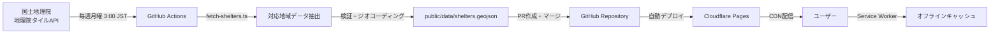

# 鳴門市避難所マップ - マスタープラン

> **Document Version:** 2.1
> **Last Updated:** 2025-11-20
> **Author:** Yusaku Matsukawa
> **Tech Stack Update:** 2025 年最新版（pnpm, React 19, Tailwind v4, Biome）
> **Note:** ダークモード機能は削除されました（2025-11-20）

---

## 📌 プロジェクト概要

### 目的

徳島県鳴門市の公的避難所を地図上に可視化し、**オフライン環境でも避難情報を確認できる** Progressive Web App (PWA) を構築する。

地方 × 防災 × Web 技術 の実験的プロジェクトとして、誰でも使える形で公開し、技術的な学びと社会貢献を両立させる。

### コアバリュー

1. **オフラインファースト**: 電波がなくても避難所情報にアクセス可能
2. **オープンデータ活用**: 国土地理院・国土交通省の公開データを利用
3. **最新 Web 技術**: Next.js 15, React 19, Tailwind CSS v4, TypeScript, MapLibre GL JS
4. **自動更新**: GitHub Actions で毎日データを自動更新
5. **オープンソース**: MIT License で誰でも利用・改変可能

---

## 🎯 プロジェクトゴール

### MVP (Minimum Viable Product) ✅ 完了

- [x] 鳴門市内の避難所を地図上に表示
- [x] 避難所の基本情報（名称、住所、災害種別）を表示
- [x] オフライン動作（Service Worker + Cache API）
- [x] PWA としてインストール可能
- [x] レスポンシブデザイン（スマホ対応）
- [x] 災害種別フィルタ（洪水/津波/土砂災害/地震/火災）
- [x] 現在地からの距離順ソート
- [x] ルート案内（Google Maps / Apple Maps 連携）
- [x] MapLibre Vector Tiles 対応（完全オフライン）
- [x] UI改善（アイコン視認性向上、フィルタUI改善）

### Future Enhancements

- [ ] 多言語対応（英語/やさしい日本語）
- [ ] 他市町村対応（徳島県全域など）
- [ ] 避難所の詳細情報拡充（収容人数、設備情報など）

---

## 🏗️ 技術スタック（2025 年最新版）

### パッケージマネージャー

| 技術     | バージョン | 特徴                                                  |
| -------- | ---------- | ----------------------------------------------------- |
| **pnpm** | 9.x        | npm より 3 倍高速、ディスク効率的、厳密な依存関係管理 |

### フロントエンド

| 技術           | バージョン | 用途                              | 2025 更新内容                          |
| -------------- | ---------- | --------------------------------- | -------------------------------------- |
| Next.js        | **16.x**   | React フレームワーク (App Router) | Turbopack 標準、MCP対応、Webpack明示指定 |
| React          | **19.x**   | UI ライブラリ                     | `use` hook, Server Components, Actions |
| TypeScript     | 5.x        | 型安全な開発                      | Strict Mode 必須                       |
| Tailwind CSS   | **v4**     | ユーティリティファースト CSS      | Lightning CSS 統合、CSS-First 設定     |
| MapLibre GL JS | **5.14.x** | オープンソース地図ライブラリ      | Globe rendering mode 対応              |

### PWA & 状態管理

| 技術               | 用途                               |
| ------------------ | ---------------------------------- |
| next-pwa           | Service Worker + Manifest 自動生成 |
| SWR                | データフェッチング & キャッシング  |
| Zustand (optional) | グローバル状態管理                 |

### 開発ツール（2025 最新）

| ツール                  | 用途                                 | 従来比                         |
| ----------------------- | ------------------------------------ | ------------------------------ |
| **Biome**               | Lint + フォーマット（統一ツール）    | ESLint+Prettier より 20 倍高速 |
| **Chrome DevTools MCP** | ブラウザ自動化・パフォーマンス計測 | -                              |
| TypeScript Strict Mode  | 厳格な型チェック                     | -                              |
| Husky + lint-staged     | Git hooks（コミット前チェック）      | -                              |

### インフラ & CI/CD

| サービス         | 用途                      |
| ---------------- | ------------------------- |
| Cloudflare Pages | 静的ホスティング & CDN    |
| GitHub Actions   | データ自動更新 & デプロイ |
| GitHub           | ソースコード管理          |

---

## 📂 プロジェクト構造（最終形）

```
naruto-shelter-map/
├── .docs/                      # プロジェクトドキュメント（AI駆動開発）
│   ├── 00-MASTER-PLAN.md       # このファイル
│   ├── 01-phase-readme.md      # Phase 1 詳細
│   ├── 02-phase-ai-env.md      # Phase 2 詳細
│   ├── 03-phase-dev-env.md     # Phase 3 詳細
│   ├── system/                 # システム仕様
│   ├── architecture/           # アーキテクチャ決定記録
│   ├── sop/                    # 標準作業手順
│   └── README.md               # ドキュメントインデックス
│
├── .github/
│   └── workflows/
│       └── etl.yml             # データ更新自動化
│
├── public/
│   ├── data/
│   │   └── shelters.geojson    # 避難所データ
│   ├── icons/                  # PWAアイコン
│   └── manifest.json           # PWA Manifest
│
├── scripts/
│   └── fetch_shelters.ts       # データ取得ETLスクリプト
│
├── src/
│   ├── app/                    # Next.js App Router
│   │   ├── layout.tsx          # ルートレイアウト
│   │   ├── page.tsx            # トップページ
│   │   └── globals.css         # グローバルCSS
│   │
│   ├── components/             # Reactコンポーネント
│   │   ├── map/
│   │   │   ├── Map.tsx         # MapLibre地図コンポーネント
│   │   │   └── MarkerCluster.tsx
│   │   ├── shelter/
│   │   │   ├── ShelterList.tsx # 避難所リスト
│   │   │   └── ShelterDetail.tsx
│   │   └── ui/                 # 汎用UIコンポーネント
│   │
│   ├── hooks/                  # カスタムフック
│   │   ├── useShelters.ts      # 避難所データ取得
│   │   └── useGeolocation.ts   # 位置情報
│   │
│   ├── lib/                    # ユーティリティ
│   │   ├── geojson.ts          # GeoJSON処理
│   │   └── maplibre.ts         # MapLibre設定
│   │
│   └── types/                  # TypeScript型定義
│       └── shelter.ts          # 避難所型定義
│
├── AGENTS.md                   # AI Coding Agent 設定
├── CLAUDE.md                   # Claude Code 設定
├── README.md                   # プロジェクト説明
├── package.json                # 依存関係（pnpm）
├── pnpm-lock.yaml              # pnpm lockfile
├── .npmrc                      # pnpm設定
├── next.config.js              # Next.js設定
├── tsconfig.json               # TypeScript設定
├── biome.json                  # Biome設定（Lint + Format）
├── .env.example                # 環境変数サンプル
└── .gitignore                  # Git除外設定
```

---

## 🚀 実装フェーズ

### Phase 0: 環境整備（このドキュメント群の実装）

**期間:** 1 日
**ゴール:** 開発に必要なドキュメント・設定ファイルを整備

- [x] `.docs/` フォルダ作成
- [ ] プランドキュメント作成（5 ファイル）
- [ ] 各フェーズの実行準備完了

---

### Phase 1: README 更新 ⭐️ **最優先** ✅ 完了

**期間:** 0.5 日
**難易度:** ⭐️ (Easy)
**ゴール:** プロジェクトの顔となる README を整備

#### タスク

- [x] 現在の `README.md` を提供されたアイデア文書ベースに更新
- [x] プロジェクトバッジ追加（React 19, Tailwind v4, pnpm など）
- [x] 目次追加
- [x] スクリーンショット枠追加

#### 成果物

- `README.md` (更新)

#### 詳細計画

→ [.docs/01-phase-readme.md](./.01-phase-readme.md)

---

### Phase 2: AI 環境整備 ⭐️⭐️

**期間:** 1 日
**難易度:** ⭐️⭐️ (Medium)
**ゴール:** AI 駆動開発のための規約・ドキュメント整備

#### タスク

- [ ] `AGENTS.md` 作成（AI Agent 標準規格 2025）
- [ ] `CLAUDE.md` 作成（Claude Code 設定）
- [ ] `.docs/system/` ドキュメント作成
- [ ] `.docs/architecture/` ADR 作成
- [ ] `.docs/sop/` 作業手順書作成

#### 成果物

- `AGENTS.md`
- `CLAUDE.md`
- `.docs/system/` (3 ファイル)
- `.docs/architecture/` (3 ファイル)
- `.docs/sop/` (3 ファイル)

#### 詳細計画

→ [.docs/02-phase-ai-env.md](./.02-phase-ai-env.md)

---

### Phase 3: 開発環境整備 ⭐️⭐️⭐️

**期間:** 1-2 日
**難易度:** ⭐️⭐️⭐️ (Hard)
**ゴール:** ローカルで `pnpm dev` が動作する状態にする

#### タスク

- [ ] `package.json` 作成（pnpm 対応、最新依存関係）
- [ ] `.npmrc` 作成（pnpm 設定）
- [ ] `next.config.js` 作成（Turbopack 設定）
- [ ] `tsconfig.json` 作成
- [ ] `biome.json` 作成（ESLint/Prettier 置き換え）
- [ ] `src/` ディレクトリ構造作成
- [ ] Tailwind CSS v4 設定（CSS-First）
- [ ] `.env.example` 作成
- [ ] `.gitignore` 作成
- [ ] `pnpm install` 実行確認
- [ ] `pnpm dev` 起動確認

#### 成果物

- `package.json` (pnpm + React 19 + Tailwind v4)
- `.npmrc`
- `next.config.js` (Turbopack)
- `tsconfig.json`
- `biome.json`
- `.env.example`
- `.gitignore`
- `src/` (基本構造 + Tailwind v4 設定)
- `public/` (基本構造)

#### 詳細計画

→ [.docs/03-phase-dev-env.md](./.03-phase-dev-env.md)

---

### Phase 4: MVP 実装 ✅ 完了

**期間:** 完了済み
**難易度:** ⭐️⭐️⭐️⭐️
**ゴール:** 動作する MVP をデプロイ

#### タスク

- [x] MapLibre 地図コンポーネント実装
- [x] 避難所データ表示機能
- [x] PWA 設定（Service Worker, Manifest）
- [x] オフライン動作確認
- [x] レスポンシブデザイン
- [x] Cloudflare Pages デプロイ
- [x] 災害種別フィルタ実装
- [x] 現在地からの距離順ソート
- [x] ルート案内機能
- [x] MapLibre Vector Tiles 対応
- [x] UI改善（アイコン視認性向上、フィルタUI改善）

---

### Phase 5: データ自動更新 ✅ 完了

**期間:** 完了済み
**難易度:** ⭐️⭐️⭐️
**ゴール:** GitHub Actions で毎週自動更新

#### タスク

- [x] `scripts/fetch_shelters.ts` 実装
- [x] GitHub Actions ワークフロー作成（毎週月曜 3:00 JST）
- [x] 自動デプロイ設定
- [x] データ検証機能実装

#### 注意事項

避難所データは **国土地理院 地理院タイルAPI** から **毎週月曜 3:00 JST** に自動取得されます。手動実行（任意の GeoJSON ファイルを指定）も可能です。

---

## 📊 データフロー



---

## 📊 パフォーマンス計測

### PWA 計測

- **ツール:** Lighthouse CI
- **目標スコア:**
  - Performance: 90+
  - Accessibility: 95+
  - Best Practices: 95+
  - SEO: 95+
  - PWA: 100

---

## 🔐 セキュリティ & プライバシー

### データ

- **個人情報:** 一切収集しない
- **位置情報:** ブラウザ API のみ使用（サーバー送信なし）
- **分析:** 不要（プライバシーファースト）

### 依存関係

- Dependabot による自動更新
- 定期的な脆弱性スキャン

---

## 📈 成功指標（KPI）

### 技術指標

- [ ] Lighthouse PWA スコア 100
- [ ] Core Web Vitals 全項目 Good
- [ ] オフライン動作率 100%
- [ ] TypeScript エラー 0 件

---

## 🔗 参考リンク

### 技術ドキュメント（2025 年最新）

- [Next.js 15 Documentation](https://nextjs.org/docs)
- [React 19 Documentation](https://react.dev/)
- [Tailwind CSS v4](https://tailwindcss.com/)
- [MapLibre GL JS](https://maplibre.org/maplibre-gl-js/docs/)
- [Biome](https://biomejs.dev/)
- [Playwright](https://playwright.dev/)
- [Chrome DevTools Protocol](https://chromedevtools.github.io/devtools-protocol/)
- [pnpm](https://pnpm.io/)
- [next-pwa](https://github.com/shadowwalker/next-pwa)
- [Cloudflare Pages](https://developers.cloudflare.com/pages/)

### データソース

- [国土地理院 指定緊急避難場所データ](https://www.gsi.go.jp/bousaichiri/hinanbasho.html)
- [国土数値情報（避難施設データ）](https://nlftp.mlit.go.jp/ksj/)

### AI 開発

- [AGENTS.md Best Practices](https://www.builder.io/blog/agents-md)
- [Claude Code Documentation](https://docs.claude.com/en/docs/claude-code)

---

## 📝 ライセンス

MIT License - 誰でも自由に使用・改変・配布可能

詳細は `LICENSE` ファイルを参照してください。

---

## 📝 変更履歴

| バージョン | 日付       | 変更内容                                                           |
| ---------- | ---------- | ------------------------------------------------------------------ |
| 2.2        | 2025-12-06 | Next.js 16対応、UI改善（アイコン視認性向上、フィルタUI改善）完了 |
| 2.1        | 2025-11-20 | ダークモード機能削除（不要と判断）                                 |
| 2.0        | 2025-10-16 | 2025 年最新技術スタック対応                                        |

---

**Next Step:** [Phase 1: README 更新](./.01-phase-readme.md) に進む
