```mermaid
graph LR
  A[国土地理院API] -->|毎日 3:00 JST| B[GitHub Actions]
  B -->|ETLスクリプト実行| C[鳴門市データ抽出]
  C -->|GeoJSON生成| D[public/data/shelters.geojson]
  D -->|Git Commit & Push| E[GitHub Repository]
  E -->|自動デプロイ| F[Cloudflare Pages]
  F -->|CDN配信| G[ユーザー]
  G -->|Service Worker| H[オフラインキャッシュ]
```

# Phase 1: README.md 更新

> **Phase:** 1/5
> **難易度:** ⭐️ Easy
> **期間:** 0.5日（約4時間）
> **前提条件:** なし

---

## 🎯 Phase 1 のゴール

プロジェクトの「顔」となる `README.md` を整備し、以下を達成する：

1. プロジェクトの目的と価値が一目で分かる
2. 2025年最新の技術スタックと機能が明確
3. pnpm を使ったセットアップ手順が明記されている
4. プロフェッショナルな印象を与える

---

## 📋 現状分析

### 現在の README.md

```markdown
# Naruto-Shelter-Map
```

**問題点:**
- ❌ 20バイトしかない（プロジェクト名のみ）
- ❌ 技術スタックが不明
- ❌ セットアップ方法が不明
- ❌ プロジェクトの目的が不明
- ❌ スクリーンショットなし

### 理想的な README.md

- ✅ プロジェクトバッジ（ビルドステータス、ライセンスなど）
- ✅ 魅力的な説明文
- ✅ スクリーンショット/デモGIF
- ✅ 機能リスト
- ✅ 技術スタック
- ✅ セットアップ手順
- ✅ 使用方法
- ✅ アーキテクチャ図
- ✅ ライセンス情報

---

## 📝 README.md 構成案

### セクション構成（推奨順序）

```markdown
# 鳴門市避難所マップ (Naruto Shelter Map)

## Badges
- Build Status (Cloudflare Pages)
- License (MIT)
- Version
- TypeScript

## 概要
- プロジェクトの説明（1-2段落）
- デモリンク（デプロイ後）

## スクリーンショット
- メイン画面
- 検索機能
- オフライン動作

## 主な機能
- 避難所地図表示
- オフライン対応
- PWA対応
- etc.

## 技術スタック
- フロントエンド
- 地図ライブラリ
- インフラ

## データ構造
- GeoJSON サンプル

## セットアップ
- 必要な環境
- インストール手順
- 開発サーバー起動

## デプロイ
- Cloudflare Pages 設定

## データ更新フロー
- Mermaid図

## 今後の拡張
- ロードマップ

## コントリビューション
- 貢献方法

## ライセンス
- MIT License

## 作者
- プロフィール
```

---

## ✅ 実装チェックリスト

### 1. プロジェクトバッジ追加

```markdown
[](https://pages.cloudflare.com)
[](https://opensource.org/licenses/MIT)
[](https://pnpm.io/)
[](https://nextjs.org/)
[](https://react.dev/)
[](https://www.typescriptlang.org/)
[](https://tailwindcss.com/)
[](https://maplibre.org/)
```

- [ ] バッジセクション追加
- [ ] 実際のリンク設定（デプロイ後）

---

### 2. 目次追加

```markdown
## 目次

- [概要](#概要)
- [主な機能](#主な機能)
- [技術スタック](#技術スタック)
- [データ構造](#データ構造)
- [セットアップ](#セットアップ)
- [デプロイ](#デプロイ)
- [データ更新フロー](#データ更新フロー)
- [今後の拡張](#今後の拡張)
- [コントリビューション](#コントリビューション)
- [ライセンス](#ライセンス)
- [作者](#作者)
```

- [ ] 目次追加
- [ ] アンカーリンク設定

---

### 3. スクリーンショット枠追加

```markdown
## スクリーンショット

<table>
  <tr>
    <td align="center">
      
      <br>
      <sub>地図画面</sub>
    </td>
    <td align="center">
      
      <br>
      <sub>検索機能</sub>
    </td>
    <td align="center">
      
      <br>
      <sub>オフライン動作</sub>
    </td>
  </tr>
</table>

> **Note:** スクリーンショットは MVP 実装後に追加予定
```

- [ ] スクリーンショットセクション追加
- [ ] プレースホルダー設定
- [ ] 画像フォルダ作成（`docs/images/`）

---

### 4. 技術スタック詳細化

```markdown
## 技術スタック（2025年最新版）

### パッケージマネージャー
- **pnpm 9.x** - npmより3倍高速、ディスク効率的

### フロントエンド

| 技術 | バージョン | 用途 |
|------|-----------|------|
| Next.js | 15.x | React フレームワーク (App Router + Turbopack) |
| React | **19.x** | UIライブラリ（Server Components, Actions） |
| TypeScript | 5.x | 型安全な開発 |
| Tailwind CSS | **v4** | ユーティリティファーストCSS（Lightning CSS統合） |
| MapLibre GL JS | **5.9.x** | オープンソース地図ライブラリ |

### PWA & 状態管理

| 技術 | 用途 |
|------|------|
| next-pwa | Service Worker + Manifest 自動生成 |
| SWR | データフェッチング & キャッシング |

### 開発ツール

| ツール | 用途 |
|--------|------|
| **Biome** | Lint + Format（ESLint/Prettierより20倍高速） |

### インフラ & CI/CD

| サービス | 用途 |
|----------|------|
| Cloudflare Pages | 静的ホスティング & CDN |
| GitHub Actions | データ自動更新 & デプロイ |
```

- [ ] テーブル形式で技術スタック記載
- [ ] バージョン情報追加

---

### 5. セットアップ手順詳細化

```markdown
## セットアップ

### 必要な環境

- Node.js 20.x 以上
- **pnpm 9.x 以上**

### インストール

1. リポジトリをクローン

```bash
git clone https://github.com/[your-username]/naruto-shelter-map.git
cd naruto-shelter-map
```

2. pnpm がインストールされていない場合

```bash
npm install -g pnpm
```

3. 依存関係をインストール

```bash
pnpm install
```

4. 環境変数を設定

```bash
cp .env.example .env.local
```

5. 開発サーバーを起動

```bash
pnpm dev
```

6. ブラウザで確認

```
http://localhost:3000
```

### コマンド一覧

| コマンド | 説明 |
|---------|------|
| `pnpm dev` | 開発サーバー起動 |
| `pnpm build` | プロダクションビルド |
| `pnpm start` | プロダクションサーバー起動 |
| `pnpm lint` | Biome Lint チェック |
| `pnpm format` | Biome フォーマット |
| `pnpm type-check` | TypeScript 型チェック |
```

- [ ] セットアップセクション追加
- [ ] コマンド一覧テーブル追加

---

### 6. データ更新フロー図追加

```markdown
## データ更新フロー


```

- [ ] Mermaid図追加
- [ ] フロー説明文追加

---

### 7. コントリビューション方法追加

```markdown
## コントリビューション

貢献を歓迎します！以下の方法で参加できます：

### 貢献方法

1. **Issue を立てる**
   - バグ報告
   - 機能リクエスト
   - 質問

2. **Pull Request を送る**
   - Fork & Clone
   - Feature ブランチ作成
   - コミット（`git commit -m "feat: Add new feature"`)
   - Push & PR作成

3. **ドキュメント改善**
   - README.md
   - `.docs/` 配下のドキュメント
   - コメント追加

### コミット規約

コミットメッセージは [Conventional Commits](https://www.conventionalcommits.org/) に従ってください。

- `feat:` 新機能
- `fix:` バグ修正
- `docs:` ドキュメント
- `style:` フォーマット
- `refactor:` リファクタリング
- `test:` テスト追加
- `chore:` その他

### 行動規範

すべての参加者は敬意を持って接してください。
```

- [ ] コントリビューションセクション追加
- [ ] コミット規約記載

---

### 8. ライセンス & 作者情報

```markdown
## ライセンス

MIT License

Copyright (c) 2025 Yusaku Matsukawa

詳細は [LICENSE](./LICENSE) ファイルを参照してください。

### データ出典

- 避難所データ: [国土地理院 指定緊急避難場所データ](https://www.gsi.go.jp/bousaichiri/hinanbasho.html)
- 地図タイル: MapLibre Demo Tiles / [OpenStreetMap contributors](https://www.openstreetmap.org/copyright)

---

## 作者

**Yusaku Matsukawa**

Webエンジニア / TypeScript / AWS / GCP
Tokushima, Japan

- GitHub: [@your-username](https://github.com/your-username)
- X (Twitter): [@your-handle](https://twitter.com/your-handle)

---

**プロジェクトの目的:**

「もしもの時に電波がなくても、身近な避難所がわかる」
という課題を、エンジニアとして技術で解決したい。
地方 × 防災 × Web の小さな実験として、誰でも使える形で公開します。
```

- [ ] ライセンスセクション追加
- [ ] データ出典明記
- [ ] 作者情報追加
- [ ] プロフィールリンク設定

---

## 🔧 実装手順

### Step 1: テンプレート作成

1. 現在の `README.md` をバックアップ（必要に応じて）
2. 新しいREADMEの骨格を作成
3. 各セクションにプレースホルダーを配置

### Step 2: コンテンツ記入

1. 提供されたアイデア文書を参考に内容を記入
2. バッジURLを設定
3. 技術スタックテーブルを記入
4. セットアップ手順を記入

### Step 3: リンク設定

1. 目次のアンカーリンク確認
2. 外部リンクの動作確認
3. 画像パス設定（プレースホルダー）

### Step 4: レビュー

1. Markdown構文チェック
2. リンク切れチェック
3. 誤字脱字チェック
4. 見た目確認（GitHub上でプレビュー）

---

## 📁 関連ファイル

### 新規作成

- `docs/images/` フォルダ（スクリーンショット用）
- `LICENSE` ファイル（MIT License）
- `CONTRIBUTING.md` (Optional, Phase 2で作成可能)

### 更新

- `README.md`

---

## ✨ 完成イメージ

完成後の `README.md` は以下のような構成になります：

```
README.md (約500行)
├── Header + Badges
├── 目次
├── 概要
├── スクリーンショット (3枚)
├── 主な機能 (箇条書き)
├── 技術スタック (テーブル)
├── データ構造 (GeoJSON例)
├── セットアップ (手順 + コマンド表)
├── デプロイ
├── データ更新フロー (Mermaid図)
├── 今後の拡張
├── コントリビューション
├── ライセンス
└── 作者情報
```

---

## 🎨 スタイルガイド

### Markdown記法

- 見出しは `#` で階層化（H1→H2→H3）
- リストは `-` または `1.` で統一
- コードブロックは言語指定（`bash`, `typescript`, `json`）
- テーブルはパイプ `|` で整形
- 強調は `**太字**` または `_イタリック_`

### 絵文字使用

- セクションヘッダーに絵文字を使用して視認性向上
- 例: `## 🎯 ゴール`, `## 📋 チェックリスト`
- 使いすぎに注意（プロフェッショナルさを保つ）

---

## 🚀 Phase 1 完了後

### 次のステップ

- [ ] Phase 1 完了を確認
- [ ] `git commit -m "docs: Update README with project details"`
- [ ] **Phase 2: AI環境整備** に進む

### 確認項目

- [ ] README.md が GitHub上で正しく表示される
- [ ] すべてのリンクが機能する
- [ ] 目次からジャンプできる
- [ ] コードブロックが適切にハイライトされる
- [ ] Mermaid図が表示される

---

## 📚 参考リンク

### 良いREADMEの例

- [Best-README-Template](https://github.com/othneildrew/Best-README-Template)
- [Awesome README](https://github.com/matiassingers/awesome-readme)
- [Make a README](https://www.makeareadme.com/)

### Markdown記法

- [GitHub Flavored Markdown](https://github.github.com/gfm/)
- [Markdown Guide](https://www.markdownguide.org/)
- [Mermaid Documentation](https://mermaid.js.org/)

### バッジ生成

- [Shields.io](https://shields.io/)
- [Simple Icons](https://simpleicons.org/)

---

**Next:** [Phase 2: AI環境整備](./02-phase-ai-env.md)
**Back:** [マスタープラン](./00-MASTER-PLAN.md)
