# 鳴門市避難所マップ (Naruto Shelter Map)

[](https://pages.cloudflare.com)
[](https://opensource.org/licenses/MIT)
[](https://pnpm.io/)
[](https://nextjs.org/)
[](https://react.dev/)
[](https://www.typescriptlang.org/)
[](https://tailwindcss.com/)
[](https://maplibre.org/)

## 概要

徳島県鳴門市の公的避難所を地図上に可視化し、**オフライン環境でも避難情報を確認できる** Progressive Web App (PWA) です。

国土地理院・国土交通省のオープンデータを活用し、地図上に避難所の位置・種別・災害対応情報を表示します。スマートフォンにインストールしておけば、電波がない状況でも最後に閲覧した地図範囲と避難所情報を保持できます。

オフライン環境でも動作する PWA 技術により、いつでも避難所情報を確認できます。

> **デモサイト:** https://naruto-shelter-map.pages.dev
>
> [](https://naruto-shelter-map.pages.dev)

---

## 目次

- [概要](#概要)
- [主な機能](#主な機能)
- [データ構造](#データ構造)
- [セットアップ](#セットアップ)
- [データ更新フロー](#データ更新フロー)
- [ライセンス](#ライセンス)

---

## 主な機能

- 📍 **避難所の位置表示** - 鳴門市内の指定避難所・緊急避難場所を地図上にマーカー表示（視認性向上済み）
- 🌐 **オンライン/オフライン対応** - オンライン時は最新データ取得、オフライン時はキャッシュデータ利用
- 📶 **完全オフライン動作** - Service Worker により地図タイルもキャッシュ
- 🔍 **災害種別フィルタ** - 洪水・津波・土砂災害・地震・火災で絞り込み可能
- 📱 **PWA 対応** - ホーム画面に追加してアプリのように使用可能
- 🗺️ **MapLibre GL JS** - オープンソース地図ライブラリで高速レンダリング
- 🎨 **モダン UI** - シンプルで直感的なインターフェース
- ♿ **アクセシビリティ** - キーボード操作・スクリーンリーダー対応

---

## データ構造

避難所データは **GeoJSON 形式** で管理されています。

```json
{
  "type": "FeatureCollection",
  "features": [
    {
      "type": "Feature",
      "geometry": {
        "type": "Point",
        "coordinates": [134.609, 34.173]
      },
      "properties": {
        "name": "○○小学校",
        "type": "指定避難所",
        "address": "徳島県鳴門市○○町1-1",
        "disaster_types": ["洪水", "津波"],
        "capacity": 800,
        "source": "国土地理院オープンデータ",
        "updated_at": "2025-10-15"
      }
    }
  ]
}
```

---

## セットアップ

### 必要な環境

- Node.js 22 以上
- **pnpm 9 以上**

### インストール手順

1. **リポジトリをクローン**

```bash
git clone https://github.com/[your-username]/naruto-shelter-map.git
cd naruto-shelter-map
```

2. **pnpm をインストール（未インストールの場合）**

```bash
npm install -g pnpm
```

3. **依存関係をインストール**

```bash
pnpm install
```

4. **環境変数を設定**

```bash
cp .env.example .env.local
```

5. **開発サーバーを起動**

```bash
pnpm dev
```

6. **ブラウザで確認**

```
http://localhost:3000
```

### コマンド一覧

| コマンド            | 説明                            |
| ------------------- | ------------------------------- |
| `pnpm dev`          | 開発サーバー起動（Turbopack）   |
| `pnpm build`        | プロダクションビルド（Webpack） |
| `pnpm start`        | プロダクションサーバー起動      |
| `pnpm lint`         | Biome Lint チェック             |
| `pnpm lint:fix`     | Biome Lint 自動修正             |
| `pnpm format`       | Biome フォーマット              |
| `pnpm format:check` | Biome フォーマットチェック      |
| `pnpm type-check`   | TypeScript 型チェック           |

---

## データ更新フロー

```mermaid
graph LR
    A[国土地理院<br/>手動ダウンロード] -->|GeoJSONファイル| B[GitHub Actions]
    B -->|データ検証| C[validate-shelters.ts]
    C -->|ETLスクリプト実行| D[鳴門市データ抽出]
    D -->|GeoJSON生成| E[public/data/shelters.geojson]
    E -->|Git Commit & Push| F[GitHub Repository]
    F -->|自動デプロイ| G[Cloudflare Pages]
    G -->|CDN配信| H[ユーザー]
    H -->|Service Worker| I[オフラインキャッシュ]
```



### データ更新の仕組み

⚠️ **重要:** 国土地理院は避難所データの直接 API を提供していないため、**手動ダウンロードが必要**です。

### 最近の更新（2025 年 12 月）

- ✅ **UI 改善**: 避難所アイコンの視認性向上、フィルタ UI の改善
- ✅ **ビルド最適化**: Next.js 対応、Webpack 明示指定によるビルドエラー解消
- ✅ **パフォーマンス**: システムフォント使用による読み込み速度向上

#### 更新手順

1. **国土地理院からデータをダウンロード**

   - [国土地理院 避難所マップ](https://hinanmap.gsi.go.jp/index.html) にアクセス
   - 徳島県を選択（複数地域を含むデータを取得）
   - GeoJSON 形式でダウンロード

2. **GitHub Actions ワークフローを実行**

   ```bash
   gh workflow run update-data.yml -f data_file=path/to/downloaded-file.geojson
   ```

3. **自動処理**
   - データ検証（`scripts/validate-shelters.ts`）
   - 対応地域のデータを抽出・正規化（鳴門市 + 隣接4地域）
   - `public/data/shelters.geojson` を更新
   - 変更をコミット & プッシュ
   - Cloudflare Pages が自動デプロイ

#### 対応地域

- 鳴門市（メイン地域）
- 藍住町、北島町、松茂町、板野町（隣接地域）

#### データ検証

データ更新時には自動的に検証が実行されます：

- ✅ 座標と住所の整合性チェック
- ✅ 対応地域の範囲外の座標を検出
- ✅ 住所に対応地域名が含まれているかチェック
- ✅ 住所に「徳島市」が含まれているデータを検出
- ⚠️ 境界付近の座標を警告

手動で検証を実行する場合：

```bash
pnpm tsx scripts/validate-shelters.ts
```

#### スケジュール実行について

GitHub Actions は毎週月曜 3:00 JST に起動しますが、**国土地理院からの手動ダウンロードが必要**なため、実際の更新は手動でワークフローを実行する必要があります。

> **Note:** 緊急時（災害発生時など）は手動でワークフローを実行可能

---

## ライセンス

MIT License

Copyright (c) 2025 Yusaku Matsukawa

詳細は [LICENSE](./LICENSE) ファイルを参照してください。

### データ出典

- **避難所データ:** [国土地理院 指定緊急避難場所データ](https://www.gsi.go.jp/bousaichiri/hinanbasho.html)
- **地図タイル:** MapLibre Demo Tiles / [OpenStreetMap contributors](https://www.openstreetmap.org/copyright)
