# 鳴門市避難所マップ (Naruto Shelter Map)

[](https://pages.cloudflare.com)
[](https://opensource.org/licenses/MIT)
[](https://pnpm.io/)
[](https://vitejs.dev/)
[](https://react.dev/)
[](https://www.typescriptlang.org/)
[](https://tailwindcss.com/)
[](https://maplibre.org/)

## 概要

徳島県鳴門市とその隣接地域（藍住町、北島町、松茂町、板野町）の公的避難所を地図上に可視化し、**オフライン環境でも避難情報を確認できる** Progressive Web App (PWA) です。

国土地理院・国土交通省のオープンデータを活用し、地図上に避難所の位置・種別・災害対応情報を表示します。スマートフォンにインストールしておけば、電波がない状況でも最後に閲覧した地図範囲と避難所情報を保持できます。

オフライン環境でも動作する PWA 技術により、いつでも避難所情報を確認できます。

> **デモサイト:** https://naruto-shelter-map.pages.dev
>
> [](https://naruto-shelter-map.pages.dev)

---

## 目次

- [概要](#概要)
- [主な機能](#主な機能)
- [技術スタック](#技術スタック)
- [データ構造](#データ構造)
- [セットアップ](#セットアップ)
- [デプロイ](#デプロイ)
- [データ更新フロー](#データ更新フロー)
- [今後の拡張](#今後の拡張)
- [コントリビューション](#コントリビューション)
- [ライセンス](#ライセンス)
- [作者](#作者)

---

## 主な機能

- 📍 **避難所の位置表示** - 鳴門市とその隣接地域（藍住町、北島町、松茂町、板野町）の指定避難所・緊急避難場所を地図上にマーカー表示（視認性向上済み）
- 🌐 **オンライン/オフライン対応** - オンライン時は最新データ取得、オフライン時はキャッシュデータ利用
- 📶 **完全オフライン動作** - Service Worker により地図タイルもキャッシュ
- 🔍 **災害種別フィルタ** - 洪水・津波・土砂災害・地震・火災で絞り込み可能
- 📱 **PWA 対応** - ホーム画面に追加してアプリのように使用可能
- 🗺️ **MapLibre GL JS** - オープンソース地図ライブラリで高速レンダリング
- 🎨 **モダン UI** - シンプルで直感的なインターフェース
- ♿ **アクセシビリティ** - キーボード操作・スクリーンリーダー対応

---

## 技術スタック

### パッケージマネージャー

| 技術     | バージョン | 特徴                         |
| -------- | ---------- | ---------------------------- |
| **pnpm** | 9.x 以上   | 高速・ディスク効率・厳密な依存関係管理 |

### フロントエンド

| 技術             | バージョン | 用途                                    |
| ---------------- | ---------- | --------------------------------------- |
| Vite             | **6.x**    | ビルドツール（開発サーバー・本番ビルド） |
| React            | **19.x**   | UI ライブラリ                            |
| TypeScript       | 5.x        | 型安全な開発                            |
| Tailwind CSS     | **v4**     | ユーティリティファースト CSS（Lightning CSS） |
| MapLibre GL JS   | **5.x**    | オープンソース地図ライブラリ（Globe 対応）    |

### PWA・開発ツール・インフラ

| カテゴリ   | 技術               | 用途                           |
| ---------- | ------------------ | ------------------------------ |
| PWA        | vite-plugin-pwa    | Service Worker + Manifest（Workbox） |
| Lint/Format| **Biome**         | Lint + フォーマット（統一）    |
| ホスティング | Cloudflare Pages | 静的ホスティング & CDN         |
| CI/CD      | GitHub Actions     | データ自動更新 & デプロイ      |

---

## データ構造

避難所データは **GeoJSON 形式** で管理されています。

```json
{
  "type": "FeatureCollection",
  "features": [
    {
      "type": "Feature",
      "geometry": {
        "type": "Point",
        "coordinates": [134.609, 34.173]
      },
      "properties": {
        "name": "○○小学校",
        "type": "指定避難所",
        "address": "徳島県鳴門市○○町1-1",
        "disaster_types": ["洪水", "津波"],
        "capacity": 800,
        "source": "国土地理院オープンデータ",
        "updated_at": "2025-10-15"
      }
    }
  ]
}
```

---

## セットアップ

### 必要な環境

- Node.js 22 以上
- **pnpm 9 以上**

### インストール手順

1. **リポジトリをクローン**

```bash
git clone https://github.com/[your-username]/naruto-shelter-map.git
cd naruto-shelter-map
```

2. **pnpm をインストール（未インストールの場合）**

```bash
npm install -g pnpm
```

3. **依存関係をインストール**

```bash
pnpm install
```

4. **環境変数を設定**

```bash
cp .env.example .env.local
```

5. **開発サーバーを起動**

```bash
pnpm dev
```

6. **ブラウザで確認**

```
http://localhost:5173
```

### コマンド一覧

| コマンド            | 説明                            |
| ------------------- | ------------------------------- |
| `pnpm dev`          | 開発サーバー起動（Vite）        |
| `pnpm build`        | プロダクションビルド（dist/ に出力） |
| `pnpm preview`      | ビルド成果物のプレビューサーバー起動 |
| `pnpm lint`         | Biome Lint チェック             |
| `pnpm lint:fix`     | Biome Lint 自動修正             |
| `pnpm format`       | Biome フォーマット              |
| `pnpm format:check` | Biome フォーマットチェック      |
| `pnpm type-check`   | TypeScript 型チェック           |

---

## デプロイ

本プロジェクトは **Cloudflare Pages** にデプロイされています。

- **本番 URL:** https://naruto-shelter-map.pages.dev
- **ビルド:** `pnpm build` で生成された静的アウトプットを Cloudflare Pages が配信
- **ブランチ:** `main` へのマージで自動デプロイ（GitHub Actions 連携時）

詳細は [.docs/cloudflare-pages-setup.md](./.docs/cloudflare-pages-setup.md) を参照してください。

---

## データ更新フロー

```mermaid
graph LR
    A[国土地理院<br/>地理院タイルAPI] -->|毎週月曜 3:00 JST| B[GitHub Actions]
    B -->|fetch-shelters.ts| C[対応地域データ抽出]
    C -->|データ検証・ジオコーディング| D[validate / geocode]
    D -->|GeoJSON生成| E[public/data/shelters.geojson]
    E -->|PR作成・マージ| F[GitHub Repository]
    F -->|自動デプロイ| G[Cloudflare Pages]
    G -->|CDN配信| H[ユーザー]
    H -->|Service Worker| I[オフラインキャッシュ]
```



### データ更新の仕組み

避難所データは **国土地理院 地理院タイルAPI** から自動取得し、毎週 **月曜 3:00 JST** に GitHub Actions が実行されます。差分がある場合のみ PR が作成され、マージ後に Cloudflare Pages へ自動デプロイされます。

### 最近の更新（2025 年 12 月）

- ✅ **UI 改善**: 避難所アイコンの視認性向上、フィルタ UI の改善
- ✅ **フレームワーク移行**: Next.js から Vite + React に移行（ADR-003）
- ✅ **パフォーマンス**: システムフォント使用による読み込み速度向上

#### 自動更新（通常）

- **スケジュール**: 毎週月曜 3:00 JST（`update-data` ワークフロー）
- **データソース**: 地理院タイルAPI（`scripts/fetch-shelters.ts` で自動取得）
- **処理**: 対応地域の抽出・正規化 → 検証 → ジオコーディング（必要に応じて）→ 変更があれば PR 作成

#### 手動実行（任意）

手動でワークフローを実行する場合（例: 緊急時や任意の GeoJSON で上書きしたい場合）：

```bash
# スケジュールと同じ自動取得を即時実行
gh workflow run update-data.yml

# 特定の GeoJSON ファイルから更新（手動ダウンロードしたファイルを指定）
gh workflow run update-data.yml -f data_file=path/to/downloaded-file.geojson
```

手動で GeoJSON を使う場合は [国土地理院 避難所マップ](https://hinanmap.gsi.go.jp/index.html) から徳島県などを選択し、GeoJSON 形式でダウンロードしたファイルを指定できます。

#### 対応地域

- 鳴門市（メイン地域）
- 藍住町、北島町、松茂町、板野町（隣接地域）

#### データ検証

データ更新時には自動的に検証が実行されます：

- ✅ 座標と住所の整合性チェック
- ✅ 対応地域の範囲外の座標を検出
- ✅ 住所に対応地域名が含まれているかチェック
- ✅ 住所に「徳島市」が含まれているデータを検出
- ⚠️ 境界付近の座標を警告

手動で検証を実行する場合：

```bash
pnpm validate:shelters
```

---

## 今後の拡張

- **多言語対応** - 英語 / やさしい日本語
- **他市町村対応** - 徳島県全域など
- **避難所詳細情報の拡充** - 収容人数・設備情報など

---

## コントリビューション

貢献を歓迎します。

### 貢献方法

1. **Issue** - バグ報告・機能リクエスト・質問
2. **Pull Request** - Fork → ブランチ作成 → 変更 → PR
3. **ドキュメント** - README や `.docs/` の改善

### コミット規約

[Conventional Commits](https://www.conventionalcommits.org/) に従ってください。

- `feat:` 新機能
- `fix:` バグ修正
- `docs:` ドキュメント
- `style:` フォーマット
- `refactor:` リファクタリング
- `chore:` その他

**重要:** コミット前に `pnpm lint` と `pnpm type-check` を実行してください。詳細は [AGENTS.md](./AGENTS.md) を参照してください。

---

## ライセンス

MIT License

Copyright (c) 2025 Yusaku Matsukawa

詳細は [LICENSE](./LICENSE) ファイルを参照してください。

### データ出典

- **避難所データ:** [国土地理院 指定緊急避難場所データ](https://www.gsi.go.jp/bousaichiri/hinanbasho.html)
- **地図タイル:** MapLibre Demo Tiles / [OpenStreetMap contributors](https://www.openstreetmap.org/copyright)

---

## 作者

**Yusaku Matsukawa**

「もしもの時に電波がなくても、身近な避難所がわかる」という課題を、技術で解決するための実験プロジェクトです。地方 × 防災 × Web の小さな実験として、誰でも使える形で公開しています。
