# 鳴門市避難所マップ (Naruto Shelter Map)

[](https://pages.cloudflare.com)
[](https://opensource.org/licenses/MIT)
[](https://pnpm.io/)
[](https://nextjs.org/)
[](https://react.dev/)
[](https://www.typescriptlang.org/)
[](https://tailwindcss.com/)
[](https://maplibre.org/)

## 概要

徳島県鳴門市の公的避難所を地図上に可視化し、**オフライン環境でも避難情報を確認できる** Progressive Web App (PWA) です。

国土地理院・国土交通省のオープンデータを活用し、地図上に避難所の位置・種別・災害対応情報を表示します。スマートフォンにインストールしておけば、電波がない状況でも最後に閲覧した地図範囲と避難所情報を保持できます。

**「もしもの時に電波がなくても、身近な避難所がわかる」** ― そんな課題を、2025年最新のWeb技術で解決します。

> **デモサイト:** https://naruto-shelter-map.pages.dev
>
> [](https://naruto-shelter-map.pages.dev)

---

## 目次

- [概要](#概要)
- [主な機能](#主な機能)
- [スクリーンショット](#スクリーンショット)
- [データ構造](#データ構造)
- [セットアップ](#セットアップ)
- [データ更新フロー](#データ更新フロー)
- [ライセンス](#ライセンス)

---

## 主な機能

- 📍 **避難所の位置表示** - 鳴門市内の指定避難所・緊急避難場所を地図上にマーカー表示
- 🌐 **オンライン/オフライン対応** - オンライン時は最新データ取得、オフライン時はキャッシュデータ利用
- 📶 **完全オフライン動作** - Service Worker により地図タイルもキャッシュ
- 🔍 **避難所検索** - 名前・住所・災害種別で検索可能
- 📱 **PWA対応** - ホーム画面に追加してアプリのように使用可能
- 🗺️ **MapLibre GL JS** - オープンソース地図ライブラリで高速レンダリング
- ♿ **アクセシビリティ** - キーボード操作・スクリーンリーダー対応

---

## スクリーンショット

<table>
  <tr>
    <td align="center">
      
      <br>
      <sub>📍 地図画面</sub>
    </td>
    <td align="center">
      
      <br>
      <sub>🔍 検索機能</sub>
    </td>
    <td align="center">
      
      <br>
      <sub>📶 オフライン動作</sub>
    </td>
  </tr>
</table>

> **Note:** スクリーンショットは MVP 実装後に追加予定

---

## データ構造

避難所データは **GeoJSON 形式** で管理されています。

```json
{
  "type": "FeatureCollection",
  "features": [
    {
      "type": "Feature",
      "geometry": {
        "type": "Point",
        "coordinates": [134.609, 34.173]
      },
      "properties": {
        "name": "○○小学校",
        "type": "指定避難所",
        "address": "徳島県鳴門市○○町1-1",
        "disaster_types": ["洪水", "津波"],
        "capacity": 800,
        "source": "国土地理院オープンデータ",
        "updated_at": "2025-10-15"
      }
    }
  ]
}
```

---

## セットアップ

### 必要な環境

- Node.js 20.x 以上
- **pnpm 9.x 以上**

### インストール手順

1. **リポジトリをクローン**

```bash
git clone https://github.com/[your-username]/naruto-shelter-map.git
cd naruto-shelter-map
```

2. **pnpm をインストール（未インストールの場合）**

```bash
npm install -g pnpm
```

3. **依存関係をインストール**

```bash
pnpm install
```

4. **環境変数を設定**

```bash
cp .env.example .env.local
```

5. **開発サーバーを起動**

```bash
pnpm dev
```

6. **ブラウザで確認**

```
http://localhost:3000
```

### コマンド一覧

| コマンド | 説明 |
|---------|------|
| `pnpm dev` | 開発サーバー起動（Turbopack） |
| `pnpm build` | プロダクションビルド |
| `pnpm start` | プロダクションサーバー起動 |
| `pnpm lint` | Biome Lint チェック |
| `pnpm format` | Biome フォーマット |
| `pnpm type-check` | TypeScript 型チェック |

---

## データ更新フロー

```mermaid
graph LR
    A[国土地理院API] -->|毎週月曜 3:00 JST| B[GitHub Actions]
    B -->|ETLスクリプト実行| C[鳴門市データ抽出]
    C -->|GeoJSON生成| D[public/data/shelters.geojson]
    D -->|Git Commit & Push| E[GitHub Repository]
    E -->|自動デプロイ| F[Cloudflare Pages]
    F -->|CDN配信| G[ユーザー]
    G -->|Service Worker| H[オフラインキャッシュ]
```



### 自動更新の仕組み

1. **毎週月曜 3:00 JST** に GitHub Actions が起動
2. 国土地理院APIから最新の避難所データを取得
3. 鳴門市のデータのみを抽出・正規化
4. `public/data/shelters.geojson` を更新
5. 変更をコミット & プッシュ
6. Cloudflare Pages が自動デプロイ
7. ユーザーのService Workerがキャッシュを更新

> **Note:** 緊急時（災害発生時など）は手動でワークフローを実行可能

---

## ライセンス

MIT License

Copyright (c) 2025 Yusaku Matsukawa

詳細は [LICENSE](./LICENSE) ファイルを参照してください。

### データ出典

- **避難所データ:** [国土地理院 指定緊急避難場所データ](https://www.gsi.go.jp/bousaichiri/hinanbasho.html)
- **地図タイル:** MapLibre Demo Tiles / [OpenStreetMap contributors](https://www.openstreetmap.org/copyright)

