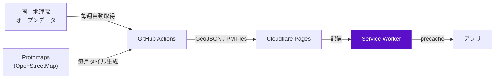
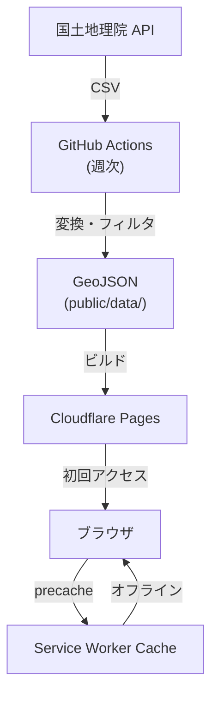

  

<h1 align="center">鳴門避難マップ</h1>

  電波がなくても使える、鳴門市周辺の避難所マップ

  <a href="https://naruto-hinan.com"><strong>naruto-hinan.com</strong></a>

  
  

  
  
  

---

## About

鳴門市とその周辺地域（藍住町・北島町・松茂町・板野町）の避難所を地図上に表示する PWA です。

スマートフォンにインストールしておけば、**電波が届かない状況でも**最後に取得した避難所情報と地図を確認できます。データは国土地理院のオープンデータを活用し、毎週自動で更新されます。

## Why

災害時、基地局が被災して携帯電話の電波が途絶えるケースは少なくありません。そのような状況でも「一番近い避難所はどこか」を確認できる手段が必要だと考え、このアプリを開発しました。

オフラインで動作する PWA として設計することで、事前にインストールしておけば通信障害時にも地図と避難所情報を参照できます。オープンデータとオープンソースのみで構成し、誰でも無料で利用・改善できることを重視しています。

## Features

- **完全オフライン動作** — 対象地域の地図タイル（PMTiles）と避難所データを同梱・precache し、初回インストール直後から圏外でも地図を表示
- **災害種別フィルタ** — 洪水・津波・土砂災害・地震・火災で絞り込み
- **経路案内** — 選択した避難所への経路をワンタップで表示
- **お気に入り** — よく使う避難所をブックマーク
- **AI チャット** — 避難所について自然言語で質問
- **PWA インストール** — ホーム画面に追加してネイティブアプリのように使用
- **アクセシビリティ** — キーボード操作・スクリーンリーダー対応

## Tech Stack

| Category | Technology |
|----------|-----------|
| UI | React 19 ・ TypeScript ・ Tailwind CSS v4 |
| Map | MapLibre GL JS 5 |
| Build | Vite 8 ・ vite-plugin-pwa |
| Hosting | Cloudflare Pages |
| CI/CD | GitHub Actions |
| Lint | Biome |

## Architecture

### Offline-First 設計

```mermaid
flowchart LR
    GSI["国土地理院\nオープンデータ"] -->|毎週自動取得| GHA["GitHub Actions"]
    PM["Protomaps\n(OpenStreetMap)"] -->|毎月タイル生成| GHA
    GHA -->|GeoJSON / PMTiles| CF["Cloudflare Pages"]
    CF -->|配信| SW["Service Worker"]
    SW -->|precache| APP["アプリ"]

    style SW fill:#5A0FC8,color:#fff
```

- 対象5市町（鳴門市・藍住町・北島町・松茂町・板野町）の**地図タイルを PMTiles 1 ファイル（約 10 MB）に固めて同梱**し、フォント・スプライトも含めて Service Worker が precache（合計約 23 MB）
- **初回アクセス（インストール）直後に圏外になっても、未閲覧エリアを含む対象地域全体の地図を表示可能**
- 避難所データ（GeoJSON）も precache し、オンライン復帰時に StaleWhileRevalidate で自動更新

### データフロー

```mermaid
flowchart TD
    A["国土地理院 API"] -->|CSV| B["GitHub Actions\n(週次)"]
    B -->|変換・フィルタ| C["GeoJSON\n(public/data/)"]
    C -->|ビルド| D["Cloudflare Pages"]
    D -->|初回アクセス| E["ブラウザ"]
    E -->|precache| F["Service Worker Cache"]
    F -->|オフライン| E
```

### Technical Challenges

- **初回起動からの完全オフライン地図** — 従来の実行時キャッシュでは閲覧済みエリアしかオフライン表示できなかったため、対象地域のベクタータイルを PMTiles 1 ファイルに固めて同梱。Service Worker の precache は Range リクエストに対応しないため、Cache Storage から Blob を slice して読み出すカスタム Source で解決
- **災害時の視認性** — ライトテーマ固定、高コントラストな配色、大きなタップターゲットなど、緊急時でも迷わず操作できる UI を優先

## Data

避難所データは [国土地理院 指定緊急避難場所データ](https://www.gsi.go.jp/bousaichiri/hinanbasho.html) を元に、GitHub Actions で毎週自動取得・更新しています。このデータは[国土地理院コンテンツ利用規約](https://www.gsi.go.jp/kikakuchousei/kikakuchousei40182.html)に基づき、出典を明示することで無償で利用可能です。

地図タイルは [Protomaps](https://protomaps.com) のベースマップビルド（[OpenStreetMap](https://www.openstreetmap.org/copyright) データ・ODbL ライセンス）から対象地域を切り出して同梱しており、GitHub Actions で毎月自動更新しています。地図フォント（Noto Sans）は SIL Open Font License です。

## License

MIT License — Copyright (c) 2025 Yusaku Matsukawa

---

  Developed by <strong>Yusaku Matsukawa</strong>

