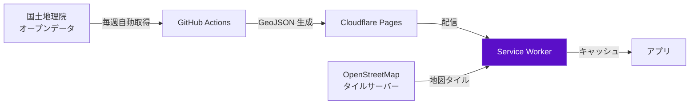
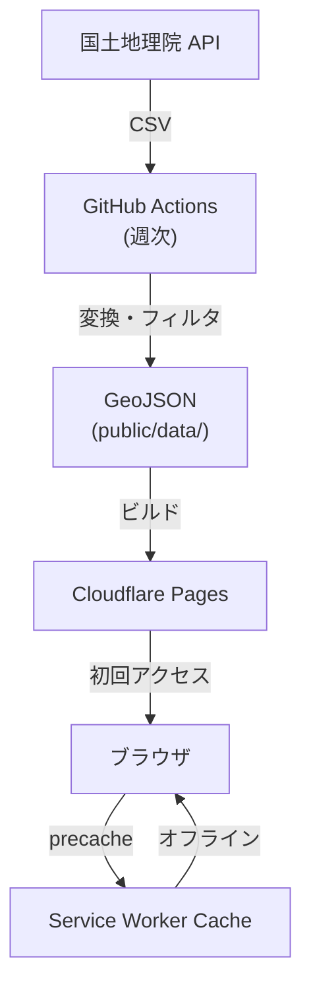

  

<h1 align="center">鳴門避難マップ</h1>

  電波がなくても使える、鳴門市周辺の避難所マップ

  <a href="https://naruto-hinan.com"><strong>naruto-hinan.com</strong></a>

  
  

  
  
  

---

## About

鳴門市とその周辺地域（藍住町・北島町・松茂町・板野町）の避難所を地図上に表示する PWA です。

スマートフォンにインストールしておけば、**電波が届かない状況でも**最後に取得した避難所情報と地図を確認できます。データは国土地理院のオープンデータを活用し、毎週自動で更新されます。

## Why

災害時、基地局が被災して携帯電話の電波が途絶えるケースは少なくありません。そのような状況でも「一番近い避難所はどこか」を確認できる手段が必要だと考え、このアプリを開発しました。

オフラインで動作する PWA として設計することで、事前にインストールしておけば通信障害時にも地図と避難所情報を参照できます。オープンデータとオープンソースのみで構成し、誰でも無料で利用・改善できることを重視しています。

## Features

- **オフライン動作** — Service Worker で地図タイルと避難所データをキャッシュ
- **災害種別フィルタ** — 洪水・津波・土砂災害・地震・火災で絞り込み
- **経路案内** — 選択した避難所への経路をワンタップで表示
- **お気に入り** — よく使う避難所をブックマーク
- **AI チャット** — 避難所について自然言語で質問
- **PWA インストール** — ホーム画面に追加してネイティブアプリのように使用
- **アクセシビリティ** — キーボード操作・スクリーンリーダー対応

## Tech Stack

| Category | Technology |
|----------|-----------|
| UI | React 19 ・ TypeScript ・ Tailwind CSS v4 |
| Map | MapLibre GL JS 5 |
| Build | Vite 8 ・ vite-plugin-pwa |
| Hosting | Cloudflare Pages |
| CI/CD | GitHub Actions |
| Lint | Biome |

## Architecture

### Offline-First 設計

```mermaid
flowchart LR
    GSI["国土地理院\nオープンデータ"] -->|毎週自動取得| GHA["GitHub Actions"]
    GHA -->|GeoJSON 生成| CF["Cloudflare Pages"]
    CF -->|配信| SW["Service Worker"]
    SW -->|キャッシュ| APP["アプリ"]

    OSM["OpenStreetMap\nタイルサーバー"] -->|地図タイル| SW

    style SW fill:#5A0FC8,color:#fff
```

- **Service Worker** が地図タイル・GeoJSON・フォント・スプライトをキャッシュ
- オフライン時は最後にキャッシュされたデータで地図と避難所を表示
- オンライン復帰時に StaleWhileRevalidate でデータを自動更新

### データフロー

```mermaid
flowchart TD
    A["国土地理院 API"] -->|CSV| B["GitHub Actions\n(週次)"]
    B -->|変換・フィルタ| C["GeoJSON\n(public/data/)"]
    C -->|ビルド| D["Cloudflare Pages"]
    D -->|初回アクセス| E["ブラウザ"]
    E -->|precache| F["Service Worker Cache"]
    F -->|オフライン| E
```

### Technical Challenges

- **地図タイルのオフラインキャッシュ** — ベクタータイル (.pbf) を CacheFirst 戦略で最大 2,000 エントリまでキャッシュ。閲覧済みエリアをオフラインで再表示可能にしつつ、ストレージ肥大を防止
- **Mapbox → MapLibre 移行** — 従量課金リスクを回避するため、BSD-3-Clause ライセンスの MapLibre GL JS を採用。OSM Japan タイルサーバーと組み合わせてコストゼロで運用
- **Next.js → Vite 移行** — SSR・API Routes が不要な SPA にとって Next.js はオーバーヘッド。Vite + React に移行し、HMR 高速化とビルドサイズ削減を実現（[ADR-003](.docs/architecture/adr-003-framework-vite.md)）
- **災害時の視認性** — ライトテーマ固定、高コントラストな配色、大きなタップターゲットなど、緊急時でも迷わず操作できる UI を優先

### ADR（Architecture Decision Record）

| ADR | 概要 |
|-----|------|
| [ADR-001: PWA フレームワーク選定](.docs/architecture/adr-001-pwa-framework.md) | 当初 Next.js + next-pwa を採用（現在は ADR-003 で置き換え） |
| [ADR-002: 地図ライブラリ選定](.docs/architecture/adr-002-map-library.md) | ライセンスとコストを考慮し MapLibre GL JS を採用 |
| [ADR-003: Vite 移行](.docs/architecture/adr-003-framework-vite.md) | SSR 不要のため Next.js から Vite + React へ移行 |

## Data

避難所データは [国土地理院 指定緊急避難場所データ](https://www.gsi.go.jp/bousaichiri/hinanbasho.html) を元に、GitHub Actions で毎週自動取得・更新しています。

地図タイルは [OpenStreetMap](https://www.openstreetmap.org/copyright) のデータを使用しています。

## License

MIT License — Copyright (c) 2025 Yusaku Matsukawa

---

  Developed by <strong>Yusaku Matsukawa</strong>

